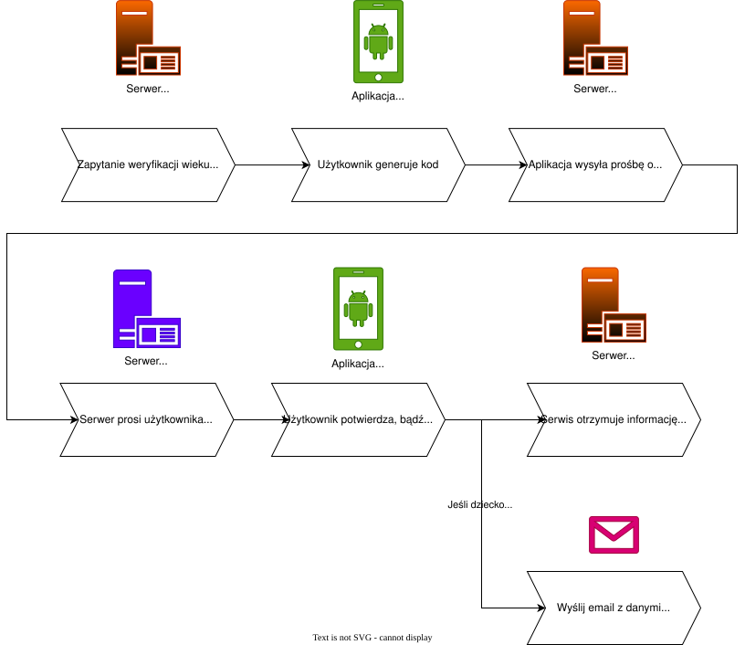
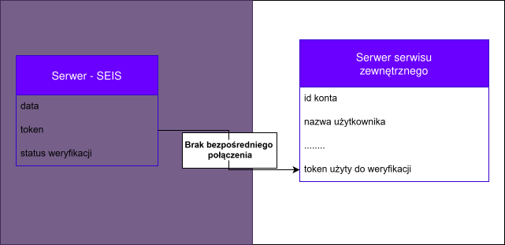
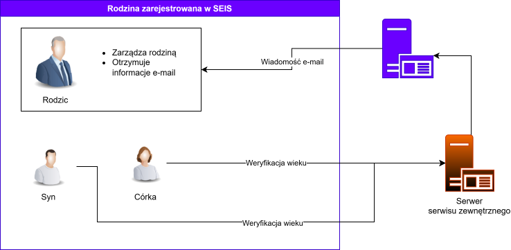
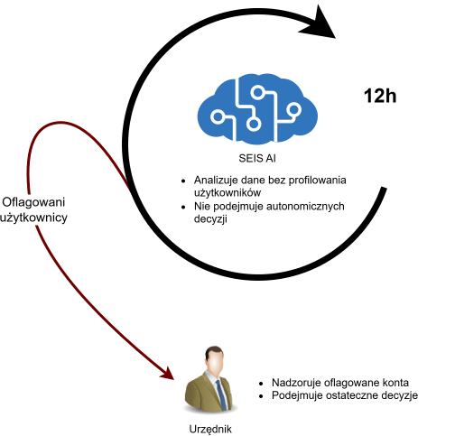

# SEIS - Signle Endpoint ID Service

**SEIS** to system zwiększający bezpieczeństwo danych podczas weryfikacji wieku i tożsamości online, który ma na celu dbać o **anonimowość** i **wygodę** użytkownika.

Zamiast przesyłać skan dowodu, użytkownik generuje jednorazowy kod w aplikajci. Platforma (np. Discord) wysyła ten kod do systemu państwowego, który weryfikuje kryterium wiekowe i zwraca wyłącznie odpowiedź „tak/nie”, bez ujawniania jakichkolwiek danych osobowych użytkownika. 

<div style="background-color: #00000012; padding: 20px 0; display: flex; margin-block: 20px; justify-content: space-around; align-items:center;">
  
  
</div>


---

## O projekcie

Wideo: https://youtube.com/shorts/6B33ywocC9Q?feature=share

Prezentacja: https://drive.google.com/file/d/1O6MbuWFnuKipe0fa4I92AFEwTUp27ujz/view?usp=drive_link

## Privacy by design
- Podczas weryfikacji serwer SEIS przekazuje platformom trzecim jedynie informacje o tym, czy użytkownik spełnia podane wymaganie wiekowe
- Serwis nie przechowuje informacji na temat platform, które użytkownik odwiedzał
- Kod jest aktywny 5 minut i wymaga potwierdzenia

## Jak to działa?
Uproszczony diagram prezentujący działanie **serwisu SEIS**
<center>

</center>

## System tokenów
Podczas weryfikacji użytkownika generowany jest unikalny token, który następnie zostaje rozdzielony między dwa niezależne serwery — serwer SEIS oraz serwer serwisu zewnętrznego — **przy czym żaden z nich nie posiada pełnego obrazu tożsamości użytkownika.**

Serwer SEIS przechowuje powiązanie tokenu z tożsamością użytkownika oraz datą jego wygenerowania, natomiast serwer serwisu zewnętrznego wiąże ten sam token wyłącznie z kontem użytkownika na swojej platformie. Oba zbiory danych są od siebie izolowane i samodzielnie nie pozwalają na identyfikację osoby.
Połączenie obu baz — a tym samym odtworzenie pełnej ścieżki między użytkownikiem a jego aktywnością na platformie — jest możliwe wyłącznie w ramach formalnego postępowania śledczego i wymaga jednoczesnego dostępu do obu serwerów.

Takie podejście realizuje dwa pozornie sprzeczne cele: ochronę prywatności użytkownika w codziennym użytkowaniu oraz możliwość skutecznego reagowania na nadużycia przez uprawnione organy, gdy zajdzie taka potrzeba
<center>

</center>

## Funkcje rodzinne

Z myślą o rodzicach, którzy chcą monitorować aktywność swoich dzieci w systemie SEIS, wdrożono funkcję grup rodzinnych. Po dodaniu dziecka do takiej grupy, rodzic otrzymuje powiadomienie e-mail zawierające informację o platformie, na której doszło do rejestracji za każdym razem, gdy dziecko skorzysta z procesu weryfikacji.

Przykładowy schemat rodziny w systemie

<center>

</center>

## Moduł AI

Moduł AI został zaprojektowany jako odpowiedź na wyzwania związane z nadużyciami, takimi jak próby weryfikacji cudzych kont czy automatyczne generowanie dużej liczby zapytań przez boty. Jego zadaniem jest zwiększenie bezpieczeństwa i wiarygodności systemu przy jednoczesnym zachowaniu możliwie najwyższego poziomu anonimowości użytkowników.

Analizator AI SEIS działa wyłącznie na danych nieosobowych - takich jak wzorce czasowe czy statusy weryfikacji - i nie przetwarza informacji pozwalających na identyfikację konkretnej osoby. Co istotne, system nie ingeruje bezpośrednio w konta użytkowników: nie posiada uprawnień do ich blokowania ani nakładania ograniczeń. Jego funkcja sprowadza się do wykrywania potencjalnie nieprawidłowych zachowań i oznaczania ich do dalszej oceny.

<center>

</center>

## Łatwość implementacji

Zgodnie z nazwą, aplikacja opiera się na pojedynczym endpoincie, co sprawia, że implementacja sprowadza się do wysłania jednego zapytania przy procesie weryfikacji wieku. 

Bardziej szczegółowe implementacje znajdują się w [przykładach](#demonstracyjne-serwisy).

```js
// (w przykładzie serwis SEIS zahostowany na domenie `seis.net`)
const code = "123456"
const response = await fetch("http://seis.net/users/verify-age", {
  method: "POST",
  headers: {
    "Content-Type": "application/json",
  },
  body: JSON.stringify({ "requested_age": 13, "meta": "facebook.com", "code": code }),
});
```

## Struktura projektu

Kazdy moduł zawiera plik `README.md`, który konkretniej opisuje jego funkcjonalności oraz instrukcję uruchomienia.

### SEIS

- `backend`
  - `ApiServer` - serwer REST API obsługujący całą logikę systemu
  - `AiAnalyzer` - dodatkowy moduł umożliwiający analizę bazy danych pod kątem podejrzanych zachowań przy pomocy lokalnego AI
- `mobile_authenticator` - aplikacja użytkownika, główny moduł

### Demonstracyjne serwisy

Przykładowe aplikacje 

- `nexus_app` - aplikacja z przykładem rejestracji użytkownika
- `self_checkout` - system kasy samoobsługowej
  - `Kasa` - interfejs kasy samoobsługowej
  - `NFC_Reader` - aplikacja mobilna obsługująca odczytywanie danych NFC

## Autorzy

- [Karol Szelc](https://github.com/plaszel)
- [Kacper Bronka](https://github.com/kacperbronka)
- [Maciej Michalik](https://github.com/janngo27)
- [Sebastian Drabik](https://github.com/sebastiandrabik)

## Użyte narzędzia

- W projekcie użyto AI: [claude ai](claude.ai), [chatgpt](chat.openai.com), [github copilot](https://github.com/features/copilot)
- Diagramy i infografiki: [draw.io](draw.io)
- Montaż wideo: Da Vinci Resolve