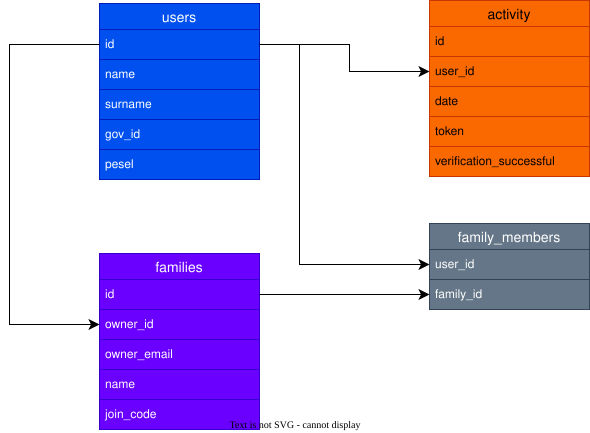

# SEIS Backend - Docker i API

Serwer API serwisu SEIS

[Dokumentacja endpointów](./endpoints.md)

## Uruchomienie i konfiguracja serwera przez Docker

### Wymagania

- Docker
- Docker Compose

### Szybki start

W katalogu projektu uruchom:

```bash
docker compose up --build
```

Po starcie:

- API będzie dostępne pod adresem `http://localhost:2000`
- MariaDB będzie dostępna na porcie `3307`

### Zatrzymanie środowiska

```bash
docker compose down
```

### Konfiguracja (docker-compose.yml)

Konfiguracja jest ustawiana bezpośrednio w `docker-compose.yml`.

Aktualnie backend (`seis-backend`) dostaje m.in.:

- `PORT=80`
- `HOST=0.0.0.0`
- `DB_HOST=mariadb`
- `DB_PORT=3307`
- `DB_USER=seis`
- `DB_PASSWORD=seis_password`
- `DB_DATABASE=seis`

Aktualnie baza (`mariadb`) ma m.in.:

- `MARIADB_ROOT_PASSWORD=root_password`
- `MARIADB_DATABASE=seis`
- `MARIADB_USER=seis`
- `MARIADB_PASSWORD=seis_password`

Jeśli zmienisz dane bazy połączeniowej, zachowaj spójność między sekcją `seis-backend.environment` i `mariadb.environment`.

### Baza danych

#### Struktura bazy

<center>

</center>

#### Migracje

Migracje SQL uruchamiają się automatycznie przy starcie serwera.

Możesz też uruchomić je ręcznie:

```bash
npm run migrate
```