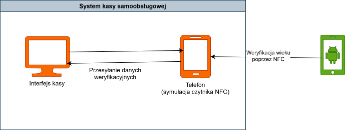

# Self Checkout

Ten katalog zawiera prototyp systemu samoobslugowej kasy, podzielony na dwa glowne komponenty:

- `Kasa/` - aplikacja desktopowa pelniaca role klienta kasy.
- `NFC_Reader/` - aplikacja mobilna wykorzystujaca czytnik NFC w telefonie do odczytu kodu NFC potrzebnego do weryfikacji wieku uzytkownika.

## Uruchamianie projektu

Aby projekt poprawnie działał należy:
- skompilować i uruchomić aplikację `Kasa`
- skompilować i uruchomić aplikację `NFC_Reader`
- **Ustawić IP urządzenia na którym uruchomiona jest Kasa na `10.27.114.73`**, lub alternatywnie zmienić adres IP serwera nasłuchiwania w [kodzie serwera](./Kasa/Kasa/MainWindow.xaml.cs) **oraz** w [kodzie aplikacji mobilnej](./NFC_Reader/app/src/main/java/com/example/nfc_reader/MainActivity.kt)

## Cel projektu

Celem projektu jest pokazanie przeplywu obslugi transakcji w scenariuszu self-checkout:

1. Klient obsluguje koszyk w aplikacji desktopowej (`Kasa`).
2. Przy probie zakupu produktu z ograniczeniem wiekowym uruchamiana jest weryfikacja wieku.
3. Aplikacja mobilna (`NFC_Reader`) odczytuje kod NFC i przekazuje wynik do procesu kasowego.

## Architektura prototypu

### 1) Kasa (`Kasa/`)

Aplikacja desktopowa odpowiada za warstwe interfejsu i logiki stanowiska kasowego, m.in.:

- prezentacje listy produktow,
- obsluge sesji zakupowej,
- podsumowanie i finalizacje transakcji.

### 2) NFC Reader (`NFC_Reader/`)

Aplikacja mobilna uruchamiana na telefonie odpowiada za:

- odczyt kodu NFC przy pomocy telefonu,
- wsparcie procesu weryfikacji wieku dla produktow ograniczonych wiekowo,
- przekazanie wyniku weryfikacji do procesu kasowego,
- szybkie prototypowanie scenariusza bez dodatkowego sprzetu.

Kasa tworzy serwer nasłuchujący na weryfikację z telefonu(symulatora NFC)

## Dlaczego telefon zamiast urzadzenia embedded?

W docelowym, produkcyjnym rozwiazaniu funkcja czytnika bylaby realizowana przez dedykowany system embedded (np. modul wbudowany w stanowisko kasowe) obslugujacy proces weryfikacji wieku.

W tym projekcie, dla prostoty i latwego dostepu do prototypu, wykorzystano telefon z NFC. Takie podejscie pozwala:

- szybciej testowac funkcjonalnosc,
- obnizyc koszt wejscia podczas fazy prototypowania,
- latwo odtwarzac scenariusze testowe na powszechnie dostepnym sprzecie.

## Uwagi

W tym scenariuszu nie implementujemy zapisywania tokenów po stronie podmiotu weryfikującego. Implementacja zapisu tokenów zaimplementowana jest w [aplikacji demo nexus](./../nexus_app/README.md)

Projekt ma charakter prototypowy. Architektura moze zostac rozszerzona o:

- integracje z dedykowanym czytnikiem embedded,
- warstwe centralnego API,
- dodatkowe mechanizmy bezpieczenstwa i monitoringu transakcji.